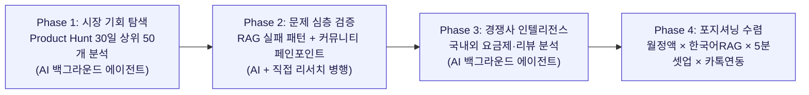
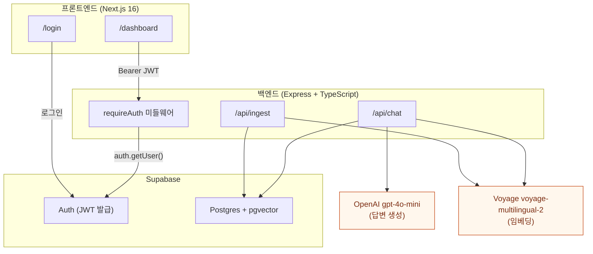
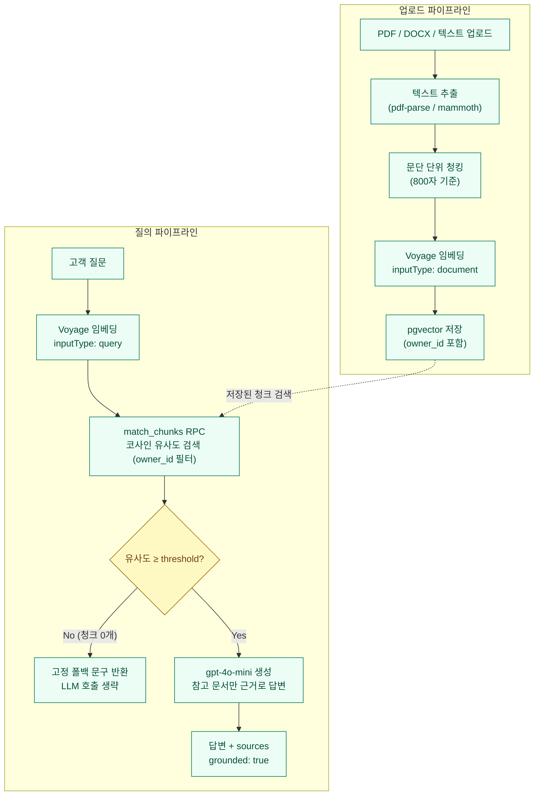
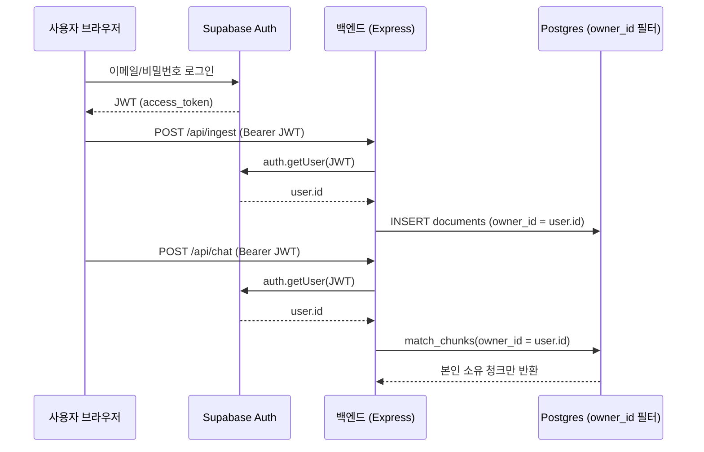
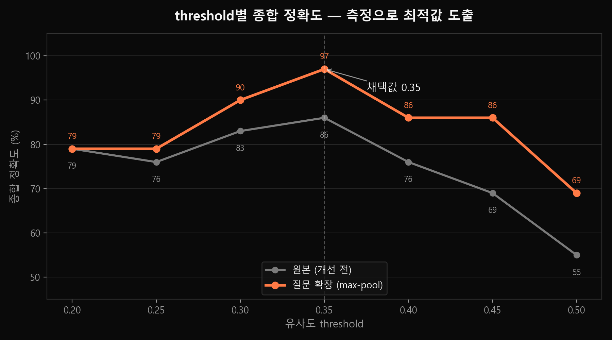
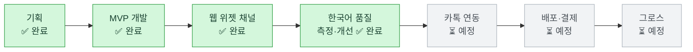

# AI 오케스트레이션 포트폴리오
## 한 줄 아이디어 → 검증된 사업 기회까지, AI로 설계한 시장 리서치 워크플로우

> **프로젝트:** 한국 SME 타겟 「AI 고객지원 RAG 챗봇」 사업 아이템 발굴 및 시장 검증
> **도구:** Claude Code (멀티 에이전트 백그라운드 리서치 활용)
> **역할:** 기획자 / AI 오케스트레이터 — 직접 코드를 짜기 전에 **AI를 지휘해 시장·문제·경쟁을 검증**
> **작성 목적:** 기획부터 개발·배포까지 이어지는 AI 활용 역량 증빙

---

## 1. 이 포트폴리오가 보여주는 것

단순히 "AI에게 질문했다"가 아니라, **모호한 사업 아이디어 하나를 데이터로 검증된 의사결정으로 바꾸기 위해 AI를 어떻게 설계·지휘했는가**를 보여줍니다.

핵심 메시지: **나는 AI를 "검색 도우미"가 아니라 "리서치 팀"으로 운용한다.**

| 보여주는 역량 | 구체적 증거 |
|---|---|
| **멀티 에이전트 병렬 리서치 설계** | 4개의 독립 리서치 작업을 백그라운드 에이전트로 분리 실행 |
| **구조화된 프롬프트 엔지니어링** | 평가 기준·출력 포맷·제약을 명시해 산출물 품질 통제 |
| **환각(hallucination) 억제 지휘** | 에이전트에게 "가짜 데이터 금지, 확인된 것과 추정을 구분" 명시 |
| **한계 인식 & 정직한 보고** | Reddit 접근 차단을 우회 시도 → 실패를 은폐하지 않고 명시 |
| **리서치 → 포지셔닝 의사결정** | 흩어진 데이터를 차별화 전략 1줄로 수렴 |

---

## 2. AI 활용 워크플로우 한눈에 보기

---

## 3. Phase별 상세 기록 (지시 → AI 활용 방식 → 핵심 결과)

### Phase 1 — 시장 기회 탐색

**🗣️ 나의 지시**
> "지난 30일 Product Hunt 상위 50개 서비스를 수집하고, 각 서비스가 해결하려는 문제와 그 공통점을 분석. 시장 규모를 알려주고, 1인 개발자가 수익화 가능한 수준의 서비스 5개를 순위별로 제시."

**🤖 AI 활용 방식 (오케스트레이션 포인트)**
- 단일 질문으로 던지지 않고 **백그라운드 리서치 에이전트**에게 위임 → 본 작업 흐름을 막지 않음
- 평가 기준을 **5개 축으로 명시**: 개발 난이도 / 초기 비용 / 수익화 명확도 / 한국 시장 수요 / 경쟁 포화도
- 출력 포맷을 지정: "문제정의 → 시장규모 → 수익모델 → 개발난이도" 구조 강제

**✅ 핵심 결과**
- 50개 서비스 카테고리 분석: **AI/자동화 35%**가 시장 주도, "Do work, not display work" 트렌드 확인
- 반복되는 핵심 문제 5가지 도출 (자동화 부재 38%, 멀티채널 관리 25%, 컨텍스트 부족 20% 등)
- **한국 시장 1인 개발 적합 TOP 5** 순위화:
  1. 이메일 AI 자동화
  2. **고객지원 자동화 챗봇** ← 최종 선택 (성장률 20.41%로 최고)
  3. B2B GTM 컨설턴트 AI
  4. 직원 교육 자동화
  5. 멀티채널 소셜 미디어 AI

---

### Phase 2 — 문제 심층 검증

**🗣️ 나의 지시**
> "고객지원 챗봇이 논의되는 커뮤니티를 찾고, 사람들이 어떤 문제를 해결 못 하는지 요약." (+ 직접 리서치로 RAG 실패 패턴 보강)

**🤖 AI 활용 방식**
- 커뮤니티(Reddit) 직접 접근이 환경상 차단 → 에이전트에게 **다중 우회 경로 시도 지시** (검색/미러/API)
- 결정적 판단: **가짜 URL·가짜 추천 수를 지어내지 말고, 못 찾으면 못 찾았다고 보고하라** 명시
- AI 리서치 + 내가 별도로 수집한 RAG 실패 분석을 **교차 검증**

**✅ 핵심 결과 — 기존 챗봇이 못 푸는 문제**
- 기술적: 의미만 비슷한 청크 검색(리트리벌 실패), 모를 때 모른다 안 함(환각), 표/구조화 데이터 깨짐, 문서 버전 관리 실패, 스케일 시 지연
- 비기술적: 초기 오답 → "AI는 과대광고" 인식 → SME 재계약 이탈, 지저분한 소스 문서가 품질 상한
- **한국어 특수 문제**: 한국어 임베딩 품질, 한영 혼용, 존댓말 톤, 카카오 연동
- ⚠️ **정직성 증빙**: Reddit 직접 데이터는 확보 실패를 명시하고, 2차 출처 기반임을 구분해 보고

---

### Phase 3 — 경쟁사 인텔리전스

**🗣️ 나의 지시**
> "경쟁사가 뭐가 있는지, 요금제는 어떤지, 리뷰를 살펴보고 기존 경쟁사 리뷰에서 가장 큰 불만 3가지를 정리."

**🤖 AI 활용 방식**
- 국내(채널톡·해피톡·단비AI·카카오 i 등) + 글로벌(Intercom·Zendesk·Chatbase 등) **두 그룹 동시 조사** 지시
- 리뷰 소스를 G2·Capterra·Trustpilot·블로그로 **명시 지정**
- 가격 변동성을 고려해 "확인 시점 대략" 표기 + 출처 URL 요구

**✅ 핵심 결과 — 리뷰 기반 불만 TOP 3**
| 순위 | 불만 | 근거 |
|---|---|---|
| 🔴 #1 | **종량 과금 → 비용 폭탄** | Intercom "AI가 효과적일수록 청구액↑" 역설, 채널톡 ALF 과금 개편, 해피톡 "고정요금" 마케팅이 역증 |
| 🔴 #2 | **AI 답변 품질/환각 (한국어 취약)** | Chatbase "문서에 없는 답 지어냄", 글로벌 툴 한국어 학습 부족 |
| 🔴 #3 | **설정 복잡 + 지원 부실** | Zendesk 셋업 복잡, Freshchat 지원 지연, 영어 UI·시차 장벽 |

> 💡 핵심 통찰: 해피톡이 "채널톡 대비 50%·고정요금"으로 이미 틈을 공략 중 → **이 전략이 시장에서 검증됐다는 증거**

---

### Phase 4 — 포지셔닝 수렴

**🤖 AI 활용 방식**
- 3개 Phase의 흩어진 데이터(트렌드 + 문제 + 경쟁 불만)를 **하나의 차별화 전략으로 종합**
- 경쟁사 불만 ↔ 나의 해결책을 1:1 매핑

**✅ 최종 포지셔닝**
> **"월 정액(비용 폭탄 없음) × 한국어 RAG 품질·환각 억제 × 5분 노코드 셋업 × 카톡/네이버 네이티브 연동"**

| 경쟁사 불만 | 나의 차별화 무기 |
|---|---|
| 종량 비용 폭탄 | 월 고정 정액 + 사용량 캡 |
| 한국어 환각 | 한국어 임베딩·존댓말 톤·"모르면 모른다" 강제 |
| 셋업 복잡 + 영어 지원 | 카톡채널/스마트스토어 붙여넣기 5분 완성 |

---

## 4. 데모된 AI 활용 역량 (회사에 어필하는 포인트)

- ✅ **AI를 팀처럼 운용** — 단발 질의가 아니라 멀티 에이전트 병렬 리서치로 처리량 확장
- ✅ **프롬프트로 품질을 통제** — 평가 기준·출력 포맷·제약을 설계해 일관된 산출물 확보
- ✅ **환각을 지휘로 방어** — "가짜 데이터 금지, 확인/추정 구분"을 명시해 신뢰도 관리
- ✅ **AI의 한계를 인지하고 정직하게 보고** — 접근 불가 데이터를 은폐하지 않는 성숙한 운용
- ✅ **데이터를 의사결정으로 수렴** — 리서치를 "그래서 무엇을 만들 것인가"로 전환
- ✅ **도메인 결합** — 보안 백그라운드(프롬프트 인젝션 방어·PII 처리)를 셀링 포인트로 연결

---

## 5. 개발 단계 — 실제 구현 기술 상세 *(기획 → 동작하는 제품)*

> Phase 1~4에서 도출한 포지셔닝(**월 정액 × 한국어 RAG 환각 억제 × 5분 셋업 × 카톡 연동**)을, Claude Code와 페어 프로그래밍하며 실제로 동작하는 MVP로 구현한 기록입니다. 여기서는 "AI에게 시켰다"가 아니라 **무엇을 만들었고 왜 그렇게 설계했는지**에 집중합니다.

### 5-1. 아키텍처 & 기술 선택 근거

| 영역 | 기술 | 선택 이유 |
|---|---|---|
| 백엔드 | Node.js + TypeScript + Express 5 | 빠른 반복, 타입 안정성 |
| 벡터 검색 | Supabase Postgres + **pgvector** (HNSW 코사인 인덱스) | 별도 벡터DB(Pinecone 등) 없이 RDB 하나로 운영 단순화 — 1인 개발 SaaS에 적합 |
| 생성 모델 | OpenAI `gpt-4o-mini` | 비용 대비 품질, 한국어 처리 |
| 임베딩 | Voyage `voyage-multilingual-2` | 한국어 포함 멀티링구얼 + **비대칭 임베딩**(query/document `inputType` 분리)으로 검색 정확도 향상 |
| 인증 | Supabase Auth (이메일/비밀번호) | 자체 인증 서버 없이 멀티테넌시를 빠르게 확보 |
| 프론트엔드 | Next.js 16 (App Router, Turbopack) + Tailwind + Framer Motion | — |

### 5-2. RAG 파이프라인 — "그냥 LLM에 문서 붙여넣기"와 다른 점

1. **업로드(ingest)**: PDF(`pdf-parse`)·Word(`mammoth`)에서 텍스트 추출 → 문단 단위 청킹(800자 기준, CSV는 헤더-행 페어링) → Voyage `document` 임베딩 → pgvector에 `owner_id`와 함께 저장
2. **질의(chat)**: 질문을 Voyage `query` 임베딩 → `match_chunks` RPC로 코사인 유사도 검색(`owner_id` 필터 + `similarity_threshold`) → 검색된 청크만 GPT 컨텍스트로 전달
3. **환각 억제 — 2단계 방어**
   - *검색 레벨*: 유사도가 threshold(기본 0.5) 미만이면 청크 0개 반환 → **LLM 호출 자체를 생략**하고 고정 폴백 문구를 즉시 반환 (오답 가능성과 API 비용을 동시에 차단)
   - *생성 레벨*: 시스템 프롬프트로 "참고 문서에 없는 내용은 절대 지어내지 말 것, 모르면 정확히 이 문장만 답할 것"을 강제 → 답변이 폴백 문구와 일치하는지로 `grounded` 여부를 판별해 `sources`(청크ID·문서ID·유사도) 메타데이터 첨부

> 문서 1개·질문 1개 단위에서는 "그냥 프롬프트에 문서 박아넣기"와 출력이 똑같아 보일 수 있습니다. 차이는 **문서가 많아질 때**(검색으로 관련 청크만 추리는지 vs 컨텍스트 전체를 매번 다 넣는지), **비용**(불필요한 LLM 호출을 검색 단계에서 차단), **출처 추적**(`sources`로 어떤 문서·어떤 유사도로 답했는지 증명 가능한지)에서 드러납니다.

### 5-3. 멀티테넌시 — RLS 대신 수동 스코핑을 선택한 이유

- 백엔드가 항상 `service_role` 키를 쓰기 때문에 Postgres RLS(Row-Level Security)는 우회됩니다. RLS에 의존하지 않고, **모든 쿼리에 `owner_id` 필터를 직접 거는 방식**으로 테넌트 데이터를 격리했습니다.
- 인증 흐름: `Authorization: Bearer <JWT>` → `requireAuth` 미들웨어가 `supabase.auth.getUser()`로 검증 → `req.userId`를 모든 라우트(ingest/chat)에 전파해 쿼리 스코프로 사용

- **검증은 코드 리뷰로 끝내지 않았습니다.** 실제 테넌트 계정 2개를 새로 만들어, 각자 다른 문서를 업로드한 뒤 교차 질문(테넌트A 계정으로 테넌트B 문서 내용을 질문)이 실제로 "모른다"로 막히는지를 curl로 4가지 시나리오 + 미인증 요청 401 케이스까지 실증했습니다.

### 5-4. 문서 업로드 — 텍스트 붙여넣기에서 실제 파일 업로드로

- 처음엔 textarea 붙여넣기로 파이프라인을 빠르게 검증했지만, **실제 사장님은 정책 문서를 텍스트가 아니라 PDF/한글 워드 파일로 갖고 있다**는 점을 검토하며 업로드 방식으로 전환
- `multer`(메모리 스토리지) + `pdf-parse` v2 + `mammoth`로 PDF·DOCX 업로드를 지원, 기존 JSON 텍스트 경로는 하위호환으로 유지
- 한글(`.hwp`)은 오픈소스로 안정적으로 파싱할 방법이 사실상 없어 **의도적으로 미지원** 처리 — 스코프를 좁히고 한계를 사용자에게 명확히 안내(PDF/Word로 변환 요청)하는 쪽을 선택

### 5-5. 실제로 부딪힌 기술적 문제 (트러블슈팅 기록)

| 문제 | 원인 | 해결 |
|---|---|---|
| Supabase `.insert()`/`.select()`가 TS에서 `never`로 추론 | `createClient<Database>` 제네릭 미지정 | 실제 SQL 스키마와 일치하는 `Database` 타입을 직접 작성 |
| OpenAI API 429(quota exceeded) | 결제수단 미등록 | 결제 등록 후 재검증 |
| Voyage AI 429 (무료 티어 3 RPM) | 연속 호출 시 rate limit | 백오프 재시도로 우회 + 프로덕션 전 결제수단 등록 필요성 확인 |
| 신규 가입 계정 로그인 시 `email_not_confirmed` | Supabase 기본 "이메일 확인" 정책 + 설정 변경이 **기존 계정엔 소급 적용 안 됨** | 설정 변경 후 신규 테스트 계정으로 전환해 검증 |
| Anthropic → OpenAI 무중단 전환 | 결제 방식 오해로 OpenAI 키만 보유 | SDK 전체 교체, 환각 억제 동작·인터페이스는 그대로 유지하며 교체 |
| 테스트용 샘플 PDF를 Chrome 헤드리스로 생성 시 한글 경로에서 `file://`가 깨짐 | Windows 환경에서 비-ASCII 경로의 `file://` URL 처리 이슈 | ASCII 경로로 빌드 후 결과 파일만 이동 |

### 5-6. 검증 방식 — "작동한다"를 어떻게 증명했는가

- 입력 포맷 4종(텍스트/CSV/PDF/DOCX) 각각 실제 파일로 추출 → 청킹 → 임베딩 → 검색까지 엔드투엔드 실행
- 멀티테넌트 격리 4개 시나리오 + 비인증 401 케이스를 실제 HTTP 요청으로 실증 (코드만 보고 "맞겠지"로 넘기지 않음)
- 환각 가드: 문서에 있는 질문 → 출처(`sources`) 포함 답변, 문서에 없는 질문 → 고정 폴백 문구. 둘 다 실제 API 호출 결과로 확인

### 5-7. 의도적으로 미룬 것 (범위 제한)

- 카카오톡/네이버 연동 — 계획은 검증됨(오픈빌더 챗봇 응답은 무료, 능동 메시지/상담톡은 건당 과금), 구현은 다음 단계
- 한글(`.hwp`) 직접 파싱
- CSV의 인용부호 내 쉼표 처리(현재는 단순 split)
- 결제/구독 과금 시스템

---

## 6. 성능 검증 및 개선 — "감"이 아니라 "측정"으로

> MVP 이후, 추가로 ⓐ 고객 대면 채널(웹 위젯)을 붙이고 ⓑ 한국어 RAG 품질을 평가셋으로 측정해 개선했다. 핵심은 "잘 된다"가 아니라 **어디서 깨지는지를 수치로 찾아 고친 것**.

### 6-1. 고객 대면 채널 추가 — 임베드 웹 위젯

학원 홈페이지에 `<script>` 한 줄로 붙는 채팅 위젯. 학부모는 로그인 없이 공개 위젯 키로 그 학원 문서 범위에서만 응답받는다. (iframe 격리로 호스트 CSS 무충돌, 분당 20회 레이트리밋, 내부 출처 메타데이터 비노출)

| 테스트 (공개 위젯, 인증 없음) | 결과 |
|---|---|
| "중등부 수강료가 얼마예요?" | ✅ 근거 기반 정답 |
| "셔틀버스 노선이 어떻게 되나요?" | ✅ 근거 기반 정답 |
| "주차장 있나요?" (문서에 없음) | ✅ "모른다" 폴백 |
| 분당 20회 초과 | ✅ 레이트리밋 429 차단 |

### 6-2. 한국어 RAG 품질 — 평가셋으로 측정

학원 지식베이스 12주제 + 골드 Q&A **29문항**(정답 22 / 무관 7, 문서 복붙이 아닌 **학부모식 구어체** 표현)으로 리트리벌 정확도를 측정. 여러 threshold를 스윕해 최적값을 데이터로 도출.

| threshold | 정답 검색(recall) | 무관 거부 | 종합 정확도 |
|---|---|---|---|
| **0.35 (채택)** | 86% | 6/7 | **86%** |
| 0.50 (초기 기본값) | 41% | 7/7 | 55% |

**발견**: 초기 기본값 0.5는 정답의 **59%를 놓쳤다.** "한국어엔 threshold가 과하게 높았다"는 게 추측이 아니라 수치로 증명됨.

### 6-3. 약점 발견 → 개선 (질문 확장 + max-pool)

평가가 정확히 짚어준 실패 모드: **구어체 어휘 갭.** "형제 **깎아주나요**?"는 맞는 청크를 찾고도 유사도 0.189로 잘렸다(문어체 "할인"과 임베딩 거리가 멂). threshold로는 못 고치는 진짜 한국어 RAG 난제.

**해결**: 검색 전에 GPT(gpt-4o-mini)가 구어체 질문을 격식체로 재작성하고, 원본·확장본 검색 결과를 **max-pool**(청크별 더 높은 유사도 채택)로 병합 → 확장이 도움만 주고 손해는 안 봄.

| 원본 질문 (구어체) | GPT 재작성 (격식체) |
|---|---|
| 형제가 같이 다니면 깎아주나요? | 형제가 함께 등록할 경우 할인 혜택이 제공됩니까? |
| 책값은 얼마인가요? | 교재비는 얼마입니까? |

**결과**: 정답 검색 recall **86% → 100%**, 종합 정확도 **86% → 97%**. 프로덕션(인증 채팅·공개 위젯 모두)에 반영했고, 실제 위젯에서 "형제 깎아주나요?" → "둘째부터 10% 할인" 정답을 확인.

### 6-4. 이 과정이 증명하는 것

- **측정 가능한 품질**: "한국어 RAG가 더 낫다"가 슬로건이 아니라 재현 가능한 평가셋(`backend/eval/`)으로 증명됨
- **2단 환각 방어 검증**: 리트리벌이 무관 청크를 잘못 가져와도(예: "원어민 강사") 생성 단계 GPT 가드가 최종 차단 → 엔드투엔드는 더 안전
- **문제 → 측정 → 개선 → 재검증의 완결 루프**: 감으로 튜닝한 값을 측정으로 검증하고, 측정이 짚은 약점을 고쳐 다시 측정

---

## 7. 향후 로드맵 — 남은 단계 (AI 활용 계획)

| 단계 | 작업 | 상태 |
|---|---|---|
| **기획** | 시장·문제·경쟁 검증, 포지셔닝 | ✅ 완료 *(섹션 1~4)* |
| **MVP 개발** | RAG 파이프라인·인증·멀티테넌시·파일 업로드 | ✅ 완료 *(섹션 5)* |
| **웹 위젯 채널** | 학원 홈페이지 임베드 공개 위젯 | ✅ 완료 *(섹션 6-1)* |
| **한국어 품질 측정·개선** | 골드 Q&A 평가셋 + 질문 확장 (recall 86→100%) | ✅ 완료 *(섹션 6-2~3)* |
| **카톡 연동** | 오픈빌더 스킬 API 연동 (사업자 인증 게이트) | ⏳ 예정 |
| **배포** | 클라우드 배포, 모니터링, 결제 연동 | ⏳ 예정 |
| **그로스** | 랜딩·콘텐츠·온보딩 | ⏳ 예정 |

---

## 8. 한계 및 검증 태도 *(정직성도 역량이다)*

- **Reddit 1차 데이터**: 환경상 직접 접근 차단 → 2차 출처 기반임을 명시. 가짜 URL/추천 수 미생성.
- **견적형 경쟁사 가격**(페르소나AI·와이즈넛 등): 공개가 미확인 → 추정으로 표기.
- **시장 규모 수치**: 리서치 시점 기준, 출처별 편차 존재 가능 → 실제 사업화 전 재확인 필요.
- **글로벌 툴 한국어 체감 품질**: 1차 리뷰 제한적 → 일부 추정 포함.

> 이 한계들을 숨기지 않고 명시하는 것 자체가, AI 산출물을 비판적으로 검증하는 운용 역량의 증거입니다.

---

*본 문서는 Claude Code 세션의 실제 작업 기록을 포트폴리오 형식으로 재구성한 것입니다. Notion에 붙여넣기/Import 하면 제목·표·체크리스트가 그대로 반영됩니다.*
