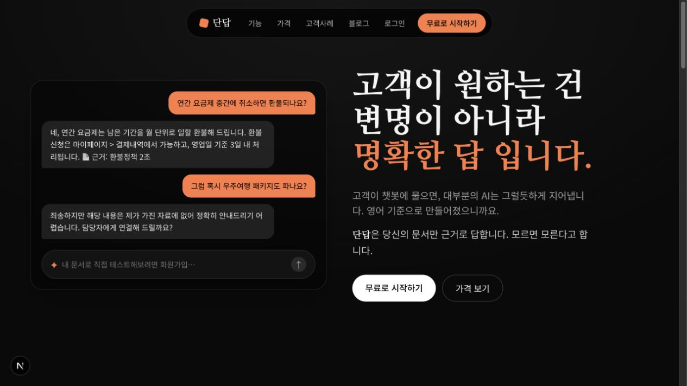
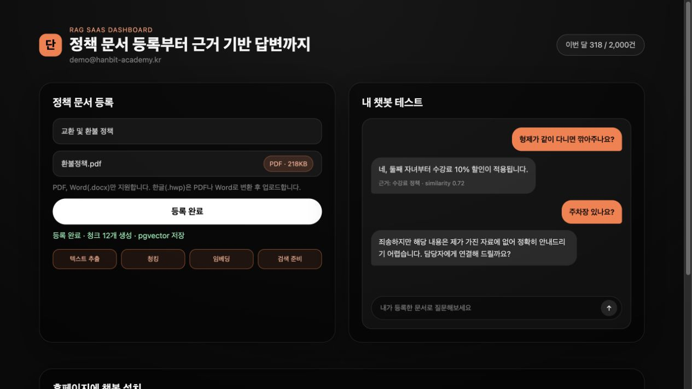
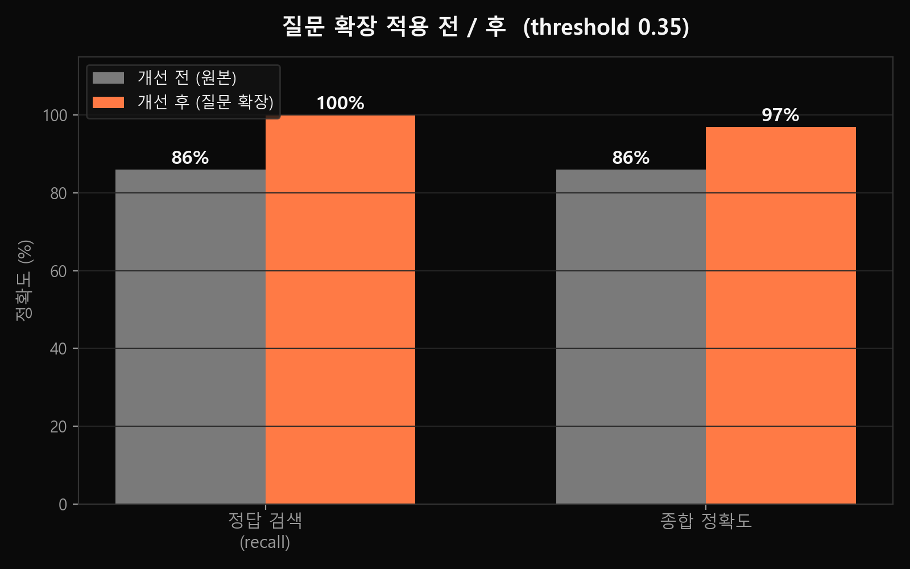
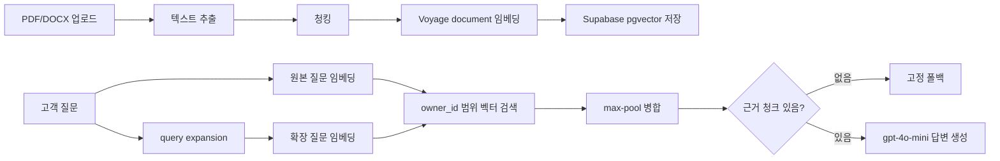

# 단답 (Dandap) — 한국어 RAG 고객지원 챗봇 SaaS

한국 학원·소상공인(SME)을 위한 **문서 기반 AI 고객지원 챗봇**입니다. PDF/DOCX 정책 문서를 업로드하면, 챗봇이 해당 문서에 근거해서 답하고 문서에 없는 내용은 "모른다"고 답하도록 설계했습니다.

> 포트폴리오 목적의 MVP입니다. 단순 API 연결보다 **한국어 RAG에서 실제로 생기는 검색 누락과 환각 문제를 어떻게 줄였는지**에 초점을 맞췄습니다.

## 화면

| 랜딩 | 대시보드: 문서 등록 + 챗봇 테스트 |
|---|---|
|  |  |

| 위젯 | 검색 품질 개선 |
|---|---|
|  |  |

## 기술 선택 이유

| 기술 | 이유 |
|---|---|
| Express + TypeScript | RAG API를 단순한 구조로 분리하고 타입 안정성 확보 |
| Supabase Auth | 별도 인증 서버 없이 사용자 식별과 tenant 기준 확보 |
| Postgres + pgvector | 문서 메타데이터, tenant, 벡터 검색을 한 DB에서 관리 |
| Voyage `voyage-multilingual-2` | 한국어 검색 품질과 query/document 비대칭 임베딩 활용 |
| OpenAI `gpt-4o-mini` | 고객지원 답변 생성에서 비용과 한국어 품질의 균형 |
| Next.js + iframe widget | 대시보드/위젯 UI 구현, 외부 사이트 CSS 충돌 최소화 |

## 문제와 해결

| 문제 | 적용한 방식 | 결과 |
|---|---|---|
| 문서에 없는 답을 지어내는 환각 | 검색 결과가 없으면 LLM 호출 없이 고정 폴백 + 생성 프롬프트 가드 | 근거 없는 질문은 "자료에 없음"으로 응답 |
| "깎아주나요", "책값" 같은 한국어 구어체 검색 누락 | query expansion + 원본/확장 질문 max-pool 검색 | 평가셋 recall **86% → 100%** |
| 학원별 문서가 섞이면 안 되는 멀티테넌트 문제 | `owner_id` 기반 저장 + 검색 RPC에서 tenant scope 필터 | 사용자/위젯별 문서 범위 분리 |
| 소상공인의 설치 부담 | `<script>` 한 줄 iframe 위젯 | 외부 사이트 CSS와 충돌하지 않는 임베드 챗봇 |

## 아키텍처



핵심 흐름은 `backend/src/lib/rag.ts`에 있습니다. 질문을 격식체로 재작성한 뒤 원본 질문과 확장 질문을 모두 검색하고, 같은 청크는 더 높은 similarity를 채택합니다.

## RAG 평가

학원 정책 코퍼스 12개 주제와 골드 질문 29개(정답 가능 22개, 무관 7개)로 리트리벌 품질을 측정했습니다.

| 방식 | 정답 검색(recall) | 무관 질문 거부 | 종합 정확도 |
|---|---:|---:|---:|
| 원본 질문만 | 19/22 (86%) | 6/7 | 86% |
| 확장 질문만 | 21/22 (95%) | 7/7 | 97% |
| **원본 + 확장 max-pool** | **22/22 (100%)** | 6/7 | **97%** |

자세한 내용: [`backend/eval/RESULTS.md`](backend/eval/RESULTS.md)

## 솔직한 한계

현재는 포트폴리오용 MVP라 운영 수준으로는 보강할 점이 있습니다.

| 한계 | 다음 개선 |
|---|---|
| 인메모리 레이트리밋 | Redis 기반 분산 레이트리밋 |
| 사용량 초과 시 경고만 표시 | 요금제별 hard cap / soft cap |
| API 레이어 `owner_id` 필터링에 의존 | RLS 정책과 멀티테넌트 테스트 강화 |
| 리트리벌 평가 중심 | 엔드투엔드 답변 정확도 평가 추가 |
| 문서 관리 기능 부족 | 문서 목록, 삭제, 재색인, 버전 관리 |

## 로컬 실행

```bash
cd backend
npm install
cp .env.example .env   # OpenAI, Voyage, Supabase 키 입력
# backend/sql/*.sql 을 Supabase SQL 에디터에서 순서대로 실행
npm run dev            # http://localhost:8787
```

```bash
cd landing
npm install
npm run dev            # http://localhost:3000
```

## 구조

```text
backend/              Express + TypeScript RAG API
backend/sql/          Supabase pgvector 스키마
backend/eval/         RAG 리트리벌 평가셋
landing/              Next.js 랜딩/대시보드/위젯
sample-docs/          테스트용 정책 문서
portfolio-diagrams/   아키텍처와 평가 이미지
```
