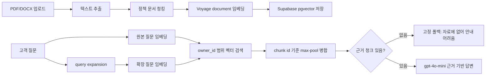

# 단답 (Dandap) — 한국어 RAG 고객지원 챗봇 SaaS

한국 학원·소상공인(SME)을 위한 **월 정액제 AI 고객지원 챗봇**. 업로드한 정책 문서(PDF·DOCX)를 근거로만 답하고, 모르면 "모른다"고 답하도록 설계해 환각을 억제합니다.

> 한 줄 아이디어를 AI 멀티에이전트 시장조사로 검증하고, 기획부터 백엔드·프론트엔드 구현까지 이어간 포트폴리오 프로젝트입니다. 자세한 기획·검증 과정은 [`AI활용_포트폴리오_사업기획.md`](AI활용_포트폴리오_사업기획.md) 참고.

## 한눈에 보는 문제 해결

이 프로젝트는 "LLM 챗봇을 붙였다"보다 **고객지원 RAG에서 실제로 깨지는 지점**을 찾고, 그 문제를 측정해서 개선하는 데 초점을 맞췄습니다.

| 문제 | 선택한 방법 | 해결한 점 |
|---|---|---|
| 문서에 없는 답을 지어내는 환각 | 검색 결과가 없으면 LLM 호출 없이 고정 폴백 + 생성 프롬프트 가드 | 근거 청크가 없을 때 "모른다"로 응답 |
| 한국어 구어체 문의가 문서 표현과 달라 검색 누락 | 질문을 문서식 표현으로 재작성(query expansion) 후 원본/확장본 max-pool 검색 | 자체 평가셋 기준 recall **86% → 100%** |
| 학원별 문서가 섞이면 안 되는 멀티테넌트 문제 | `owner_id` 기반 문서 저장 + 검색 RPC에서 테넌트 범위 필터 | 로그인 사용자/공개 위젯 모두 해당 학원 문서만 검색 |
| 소상공인이 복잡한 설치를 부담스러워함 | `<script>` 한 줄로 붙는 iframe 위젯 | 호스트 사이트 CSS와 충돌하지 않는 임베드 챗봇 |
| 정액제 포지셔닝을 코드로 보여줘야 함 | tenant별 월 사용량 미터링 | 사용량 표시와 과금 모델 확장 기반 마련 |

## 화면 미리보기

| 랜딩 페이지 | 대시보드: 문서 등록 + 챗봇 테스트 |
|---|---|
|  |  |

| 임베드 위젯 | 검색 품질 개선 |
|---|---|
|  |  |

## 핵심 차별화

경쟁사(채널톡·인터콤·Zendesk 등) 리뷰 불만을 기반으로 설계한 포지셔닝:

| 경쟁사 불만 | 단답의 해결책 |
|---|---|
| 종량 과금 → 비용 폭탄 | **월 정액제** + 사용량 미터링 |
| 한국어 답변 품질·환각 | **한국어 임베딩 + "모르면 모른다" 강제** + 유사도 임계값 가드 |
| 셋업 복잡·영어 지원 | **5분 노코드 위젯 임베드** (스크립트 한 줄) |

## RAG 파이프라인



### 왜 query expansion을 넣었나?

초기 RAG는 "형제 같이 다니면 **깎아주나요**?", "**책값** 얼마예요?" 같은 학부모식 표현에서 검색 누락이 발생했습니다. 문서에는 보통 "형제 **할인**", "**교재비**"처럼 더 격식 있는 표현이 들어가기 때문입니다.

그래서 질문을 문서에 나올 법한 표현으로 한 번 재작성하고, 원본 질문과 확장 질문을 모두 검색한 뒤 같은 청크는 더 높은 similarity를 채택했습니다.

| 변형 | 정답 검색(recall) | 무관 질문 거부 | 종합 정확도 |
|---|---:|---:|---:|
| 원본 질문만 | 19/22 (86%) | 6/7 | 86% |
| 확장 질문만 | 21/22 (95%) | 7/7 | 97% |
| **원본 + 확장 max-pool** | **22/22 (100%)** | 6/7 | **97%** |

자세한 평가 과정은 [`backend/eval/RESULTS.md`](backend/eval/RESULTS.md)에 정리했습니다.

## 기술 선택 이유

| 기술 | 선택 이유 |
|---|---|
| Express + TypeScript | API 서버를 빠르게 만들면서 요청/응답 타입을 명확히 관리 |
| Supabase Auth | 별도 인증 서버 없이 사용자별 문서 범위 확보 |
| Postgres + pgvector | 문서 메타데이터, tenant, vector search를 한 DB에서 관리 |
| Voyage `voyage-multilingual-2` | 한국어 포함 다국어 검색 품질과 query/document 비대칭 임베딩 |
| OpenAI `gpt-4o-mini` | 고객지원 답변 생성에서 비용/지연과 한국어 품질의 균형 |
| Next.js + iframe widget | 랜딩/대시보드/위젯 UI를 빠르게 구현하고 외부 사이트 CSS 충돌 최소화 |

## 저장소 구조

```
.
├── backend/              # Express + TypeScript RAG API 서버
│   ├── src/
│   │   ├── lib/          # RAG 코어 (청킹·임베딩·검색·LLM 답변)
│   │   ├── routes/       # ingest / chat / widget / tenant 엔드포인트
│   │   └── middleware/   # 인증 · 레이트리밋
│   ├── sql/              # Supabase 스키마 (pgvector, 멀티테넌트, 미터링)
│   └── eval/             # RAG 정확도 자체 평가 (goldset 기반)
├── landing/              # Next.js 랜딩페이지 + 대시보드 + 임베드 위젯
├── sample-docs/          # 테스트용 학원 정책 문서
└── portfolio-diagrams/   # 아키텍처·RAG 파이프라인 다이어그램
```

## 기술 스택

- **백엔드**: Node.js, Express 5, TypeScript
- **RAG**: Voyage AI(`voyage-multilingual-2`) 임베딩, OpenAI(`gpt-4o-mini`) 답변 생성
- **DB**: Supabase (Postgres + pgvector)
- **프론트엔드**: Next.js, React, Tailwind CSS
- **문서 파싱**: mammoth(DOCX), pdf-parse(PDF)

## RAG 파이프라인 특징 요약

질문을 격식체로 확장한 뒤 **원본 + 확장본을 함께 임베딩·검색해 max-pool로 병합**합니다. 한국어 구어체/문어체 어휘 갭으로 인한 리트리벌 누락을 줄이는 기법으로, 자체 평가셋 기준 recall이 **86% → 100%** 로 개선됐습니다. (자세한 내용: [`backend/eval/RESULTS.md`](backend/eval/RESULTS.md))

## 현재 한계와 다음 개선

현재는 MVP 단계라 운영 수준으로는 아직 보강할 점이 있습니다.

| 한계 | 다음 개선 |
|---|---|
| 인메모리 레이트리밋 | Redis 기반 분산 레이트리밋 |
| 사용량 초과 시 경고만 표시 | 요금제별 hard cap / soft cap 정책 |
| API 레이어 owner_id 필터링에 의존 | RLS 정책과 멀티테넌트 통합 테스트 강화 |
| 리트리벌 평가 중심 | 엔드투엔드 답변 정확도 평가 추가 |
| 문서 관리 기능 부족 | 문서 목록, 삭제, 재색인, 버전 관리 추가 |

## 로컬 실행

### 백엔드

```bash
cd backend
npm install
cp .env.example .env   # API 키 채우기 (OpenAI · Voyage · Supabase)
# sql/*.sql 을 Supabase SQL 에디터에서 순서대로 실행
npm run dev            # http://localhost:8787
```

### 프론트엔드

```bash
cd landing
npm install
npm run dev            # http://localhost:3000
```

## 라이선스

개인 포트폴리오용 프로젝트입니다.
